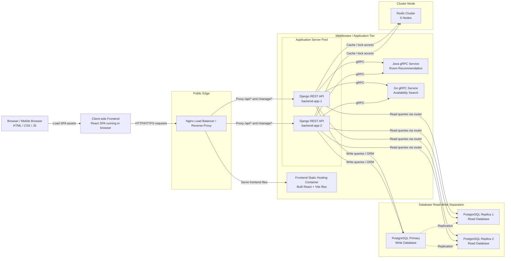
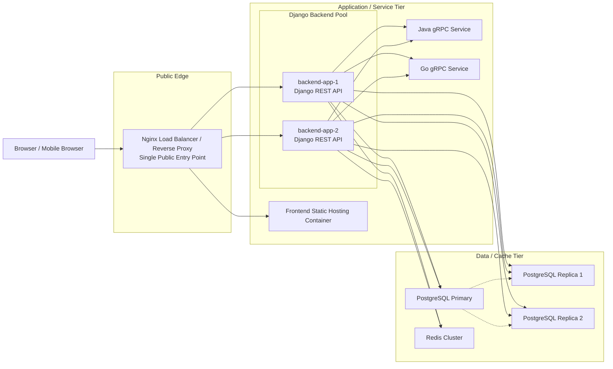

# Actual High-Level System Architecture Diagram

Below is a **report-ready simplified diagram** that matches your earlier drawing style more closely.

Important distinction:

- `Client-side Frontend` means the React SPA running in the browser
- `Frontend Static Hosting Container` means the deployed server-side container that serves the built frontend files

For your report, the first diagram below is the recommended one.

## Report-Ready Simplified Diagram

## Why this is the recommended version

This version lets you show the frontend near the client side, which matches your earlier diagram style, but it avoids a deployment error by:

- using `Client-side Frontend` for the browser runtime
- keeping the real deployed `Frontend Static Hosting Container` inside the server-side application tier

So the diagram stays both:

- visually similar to your original design diagram
- technically accurate for the implemented project

## Suggested Figure Caption

**Figure X. High-level system architecture of the implemented Study Room Booking System.**

## Suggested Paragraph for the Report

The implemented Study Room Booking System uses a multi-service web architecture. Users access the system through a browser, where a React single-page application runs on the client side after the frontend assets are loaded. All external traffic is routed through an Nginx reverse proxy, which serves the frontend files and forwards API and admin requests to a pool of Django backend containers. The Django backend handles authentication, business logic, and database interaction, and also communicates with two internal gRPC services: a Java service for room recommendation and a Go service for availability search. For persistence, the system uses a PostgreSQL primary database with two read replicas, while Redis Cluster is used for caching and distributed locking. This diagram reflects the actual implemented architecture of the project.

## More Deployment-Focused Version

If you later want a more deployment-oriented diagram, you can still use this version:

