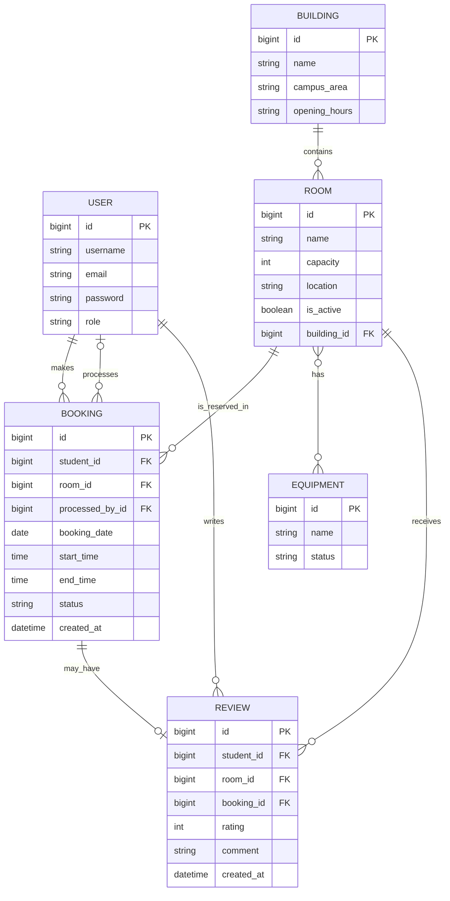

# Implemented ER Diagram

This file contains the ER diagram that matches the **actual implemented Django models**.

## Mermaid ER Diagram

## Suggested Caption

**Figure X. Entity Relationship Diagram of the implemented Study Room Booking System.**
