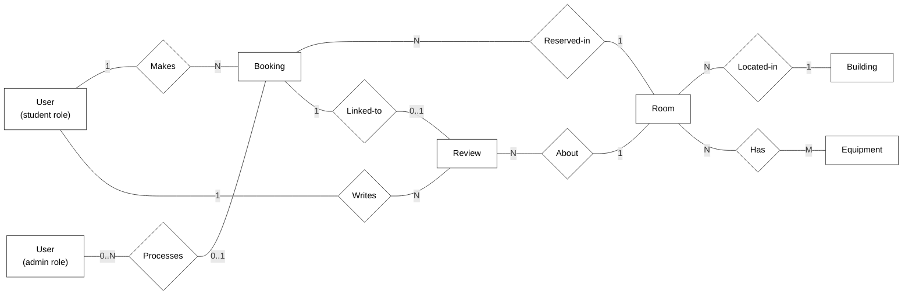

# Implemented ER Diagram in Chen-Style Layout

This file keeps the **same visual logic as your original ER diagram**:

- entities as rectangles
- relationships as diamonds
- cardinalities shown on the links

It is based on the **actual implemented models**, not the original design.

## Key Differences from the Original Design ER Diagram

1. `Student` and `Administrator` are no longer separate entities in the implementation.
   Both are represented by a single `User` model with a `role` field (`student` or `admin`).

2. `Role` and `Permission` are not implemented as separate database entities.
   The final system uses the `role` field in `User` and application-level permission logic instead.

3. The relationship between administrator and booking still exists, but it is implemented through the optional `processed_by` field in `Booking`.

4. `Review` is more tightly linked in the final implementation because it has a one-to-one relationship with `Booking`, allowing at most one review per booking.

5. The final implementation also includes concrete model fields such as booking status, room active status, equipment status, timestamps, and optional building metadata, which were not shown in the original ER design.

## Chen-Style Mermaid Diagram

## Important Note for the Report

If you use this diagram in the report, add a short clarification such as:

> In the final implementation, student and administrator roles are both represented by the same `User` entity, but they are shown separately in the diagram for readability.

## Suggested Figure Caption

**Figure X. Entity Relationship Diagram of the implemented Study Room Booking System.**

## Suggested Short Description for the Report

The implemented system uses six main entities: `User`, `Building`, `Equipment`, `Room`, `Booking`, and `Review`. In the final implementation, student and administrator accounts are both represented by the same `User` model and distinguished using a `role` field. A booking is linked to a student user and a room, and may also store the administrator who processed it. Rooms belong to buildings and can be linked to multiple equipment items. Reviews are written by users about rooms and are also linked to bookings, which allows the system to limit each booking to at most one review.
