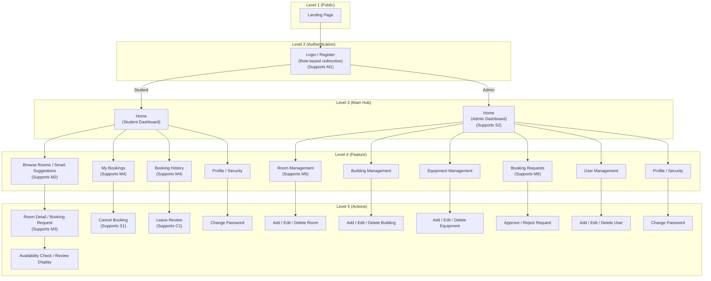

# Implemented Site Structure

This file provides an updated site structure diagram based on the actual frontend routes and key page-level actions, while keeping the same layered style as the original site map.

## Mermaid Site Structure Diagram

## Notes for Figure 3

1. `Login` and `Register` remain separate routes in the code, but they are grouped together here to preserve the original layered visual style.
2. The student journey is more detailed than the original design because room browsing is followed by a room detail page, booking request flow, availability checking, and review display.
3. The implemented system separates `My Bookings` and `Booking History` into two different pages instead of combining them into one branch.
4. The administrator structure is broader than the original design because it now includes dedicated pages for buildings, equipment, users, and profile/security.

## Suggested Figure Caption

**Figure 3. Updated site structure of the implemented Study Room Booking System.**
