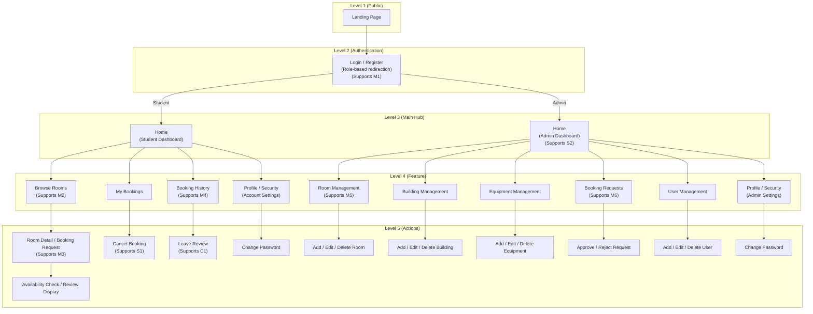

# Implemented Site Structure

This file provides an updated site structure diagram based on the **actual implemented frontend routes and pages**, while keeping the same layered style as your original site map.

## Mermaid Site Structure Diagram

## Main Differences from the Original Site Structure

1. The implemented system separates **My Bookings** and **Booking History** into two different pages rather than combining them into one feature branch.

2. The student room journey is more detailed in the final implementation:
   - `Browse Rooms`
   - `Room Detail`
   - `Booking Request`
   - `Availability Check`
   - room reviews visible on the detail page

3. The administrator side is more complete than the original design because it now includes:
   - `Building Management`
   - `Equipment Management`
   - `User Management`
   - admin profile / security settings

4. Both student and administrator roles now have a **Profile / Security** page, which was not fully represented in the original site map.

5. The implemented system keeps `Login` and `Register` as separate routes, but they are grouped together in this diagram to preserve the original visual style.

## Suggested Figure Caption

**Figure X. Updated site structure of the implemented Study Room Booking System.**

## Suggested Report Paragraph

The implemented site structure follows a role-based navigation model. Public users can access the landing page and authentication pages, after which the system redirects users to either the student or administrator dashboard according to their role. On the student side, the main features include room browsing, room detail and booking request pages, my bookings, booking history, and profile settings. On the administrator side, the implemented structure is broader than the original design and includes room management, building management, equipment management, booking request handling, user management, and profile settings. This updated site map reflects the actual implemented routes and user flows more accurately than the original design version.
